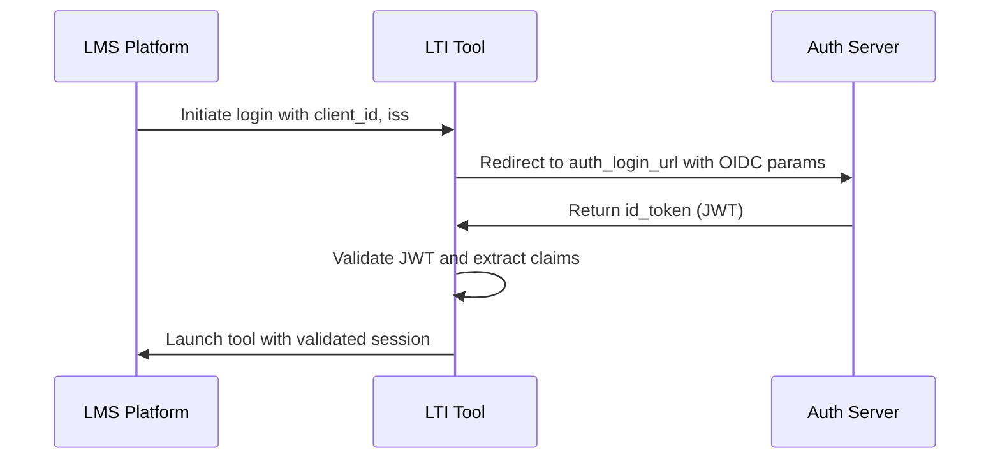
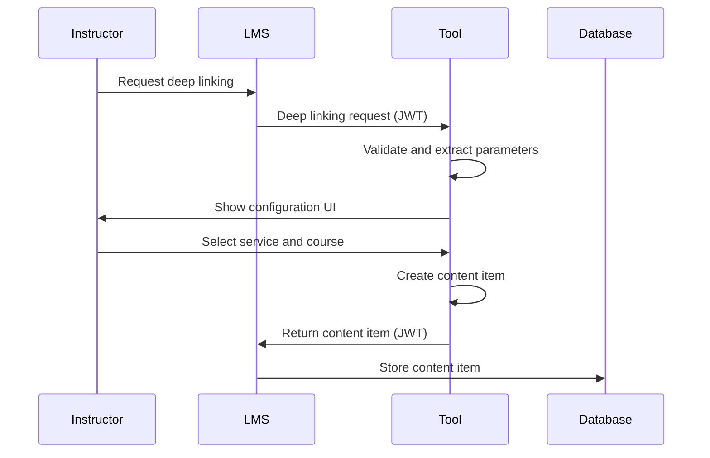

<!-- © [2025] EDT&Partners. Licensed under CC BY 4.0. -->
# LTI 1.3 Integration and Deep Linking Documentation

## Overview

This document describes the Learning Tools Interoperability (LTI) 1.3 integration and deep linking implementation in the Lecture Backend system. The LTI integration allows educational platforms (LMS) to seamlessly integrate AI-powered learning tools into their courses.

## Table of Contents

1. [Architecture Overview](#architecture-overview)
2. [LTI 1.3 Core Components](#lti-13-core-components)
3. [Deep Linking Implementation](#deep-linking-implementation)
4. [Configuration and Setup](#configuration-and-setup)
5. [API Endpoints](#api-endpoints)
6. [Service Types and Templates](#service-types-and-templates)
7. [Security and Authentication](#security-and-authentication)
8. [Troubleshooting](#troubleshooting)
9. [Development Guidelines](#development-guidelines)

## Architecture Overview

The LTI integration follows the LTI 1.3 specification and consists of several key components:

```
┌─────────────────┐    ┌─────────────────┐    ┌─────────────────┐
│   LMS Platform  │    │  LTI Backend    │    │  AI Services    │
│                 │    │                 │    │                 │
│ • Canvas        │◄──►│ • Authentication │◄──►│ • Chat Assistant│
│ • Moodle        │    │ • Deep Linking  │    │ • Quiz Generator│
│ • Blackboard    │    │ • Launch Handler│    │ • Podcast Gen.  │
└─────────────────┘    └─────────────────┘    └─────────────────┘
```

### Key Features

- **LTI 1.3 Compliance**: Full implementation of LTI 1.3 specification
- **Deep Linking**: Dynamic content creation and configuration
- **Multiple Service Types**: Support for chat, quiz generation, and podcast creation
- **Secure Authentication**: JWT-based authentication with proper key management
- **Session Management**: Persistent session handling across LTI launches

## LTI 1.3 Core Components

### 1. Authentication Flow

The LTI 1.3 authentication follows the OpenID Connect flow:



#### Key Components:

- **Login Handler** (`/lti/login`): Initiates OIDC authentication
- **Launch Handler** (`/lti/launch`): Processes validated launches
- **JWKS Endpoint** (`/.well-known/jwks.json`): Provides public keys
- **OpenID Configuration** (`/.well-known/openid-configuration`): OIDC discovery

### 2. Configuration Management

The system uses a flexible configuration system that supports multiple platforms:

```python
# Platform configuration structure
{
    "client_id": "your_client_id",
    "auth_login_url": "https://platform.com/auth/login",
    "auth_token_url": "https://platform.com/auth/token",
    "key_set_url": "https://platform.com/.well-known/jwks.json",
    "tool_jwks_url": "https://your-tool.com/lti/.well-known/jwks.json",
    "deployment_ids": ["deployment_1", "deployment_2"]
}
```

### 3. JWT Validation

All LTI requests are validated using JWT tokens:

```python
# JWT validation process
1. Extract JWT from request
2. Fetch platform's public key from JWKS
3. Verify JWT signature and claims
4. Extract launch data and custom parameters
5. Create session token for subsequent requests
```

## Deep Linking Implementation

### Overview

Deep linking allows instructors to dynamically create and configure LTI tools within their LMS. The implementation supports:

- **Dynamic Content Creation**: Create tools on-demand
- **Service Type Selection**: Choose between different AI services
- **Course Integration**: Link tools to specific courses
- **Custom Parameters**: Preserve configuration across launches

### Deep Linking Flow



### Implementation Details

#### 1. Deep Linking Request Processing

```python
# Deep linking request handler
@router.post("/deep_link")
async def deep_link(request: Request, db: Session = Depends(get_db)):
    # Extract parameters from request
    group_id = request.query_params.get("group_id")
    service_type = body.get('resource_types', [DEFAULT_SERVICE_TYPE])[0]
    course_id = custom_params.get('course_id')

    # Create launch URL with parameters
    launch_url = f"{base_url}/lti/launch?service_type={service_type}&course_id={course_id}&group_id={group_id}"

    # Create content item with custom parameters
    resource_custom_params = LTIServiceConfig.get_custom_params(service_type, course_id, group_id)

    # Return auto-submit form to LMS
    return HTMLResponse(content=response_html)
```

#### 2. Custom Parameter Preservation

The system preserves custom parameters through the JWT custom claims:

```python
# Custom parameters in JWT
{
    "https://purl.imsglobal.org/spec/lti/claim/custom": {
        "service_type": "lecture_assistant",
        "course_id": "course_uuid",
        "group_id": "group_uuid",
        "custom_service_type": "lecture_assistant",
        "custom_course_id": "course_uuid",
        "custom_group_id": "group_uuid"
    }
}
```

#### 3. Service Type Detection

The system uses a priority-based approach to detect service types:

```python
def _detect_service_type(message_launch_data, custom_params):
    # Priority 1: Query parameters in target_link_uri
    target_link_uri = message_launch_data.get('target_link_uri', '')
    if '?' in target_link_uri:
        query_params = parse_qs(urlparse(target_link_uri).query)
        service_type = query_params.get('service_type', [None])[0]
        if service_type:
            return service_type

    # Priority 2: Custom parameters from JWT
    service_type = (
        custom_params.get('service_type') or
        custom_params.get('custom_service_type') or
        custom_params.get('module_type') or
        # ... additional variations
    )

    # Priority 3: Default service type
    return DEFAULT_SERVICE_TYPE
```

## Configuration and Setup

### 1. Database Configuration

The LTI platforms are stored in the database with the following structure:

```sql
-- LTI Platforms table
CREATE TABLE lti_platforms (
    id UUID PRIMARY KEY,
    client_id VARCHAR NOT NULL,
    issuer VARCHAR NOT NULL,
    auth_login_url VARCHAR NOT NULL,
    auth_token_url VARCHAR NOT NULL,
    key_set_url VARCHAR NOT NULL,
    tool_jwks_url VARCHAR NOT NULL,
    deployment_ids JSONB,
    custom_params JSONB,
    active BOOLEAN DEFAULT true,
    group_id UUID REFERENCES groups(id),
    created_at TIMESTAMP DEFAULT NOW()
);
```

### 2. Environment Variables

Required environment variables for LTI integration:

```bash
# LTI Configuration
LTI_SESSION_TOKENS_SECRET=your_session_secret
BACKEND_DOMAIN_NAME=your_backend_domain
```

### 3. Platform Registration

To register a new LTI platform:

1. **Create Platform Record**: Add platform configuration to database
2. **Generate Keys**: Create RSA key pair for JWT signing
3. **Configure LMS**: Set up tool in LMS with correct URLs
4. **Test Integration**: Verify authentication and deep linking

## API Endpoints

### Core LTI Endpoints

| Endpoint                            | Method   | Description                    |
| ----------------------------------- | -------- | ------------------------------ |
| `/lti/login`                        | GET/POST | OIDC authentication initiation |
| `/lti/launch`                       | GET/POST | LTI launch processing          |
| `/.well-known/jwks.json`            | GET      | Public keys for JWT validation |
| `/.well-known/openid-configuration` | GET      | OpenID Connect discovery       |

### Deep Linking Endpoints

| Endpoint                            | Method | Description                   |
| ----------------------------------- | ------ | ----------------------------- |
| `/lti/deep_link`                    | POST   | Process deep linking requests |
| `/lti/deep_link/ui`                 | GET    | Deep linking configuration UI |
| `/lti/deep_link/config`             | GET    | Deep linking configuration    |
| `/lti/deep_link/courses/{group_id}` | GET    | Get courses for group         |

### Service Endpoints

| Endpoint         | Method | Description             |
| ---------------- | ------ | ----------------------- |
| `/api/chat`      | POST   | AI chat service         |
| `/quiz/generate` | POST   | Quiz generation service |

## Service Types and Templates

### Available Services

The system supports multiple AI-powered services:

#### 1. Lecture Assistant (`lecture_assistant`)

- **Purpose**: Interactive AI chat for learning support
- **Template**: `chat.html`
- **Features**: Chat interface, voice support, analytics, adaptive learning
- **Custom Parameters**: `service_type`, `course_id`, `group_id`

#### 2. Quiz Generator (`quiz_generator`)

- **Purpose**: Generate assessment questions from content
- **Template**: `quiz_generator.html`
- **Features**: Auto-generation, multiple formats, auto-grading, analytics
- **Custom Parameters**: `service_type`, `course_id`, `group_id`

#### 3. Podcast Generator (`podcast_generator`)

- **Purpose**: Generate AI-powered podcasts from content
- **Template**: `chat.html` (default)
- **Features**: PDF upload, audio generation, transcription

#### 4. Content Assistant (`content_assistant`)

- **Purpose**: AI-powered content creation and analysis
- **Template**: `chat.html` (default)
- **Features**: Content analysis, summarization, key points

### Service Configuration

```python
# Service configuration structure
SERVICE_TITLES = {
    'lecture_assistant': 'AI Assistant (Chat)',
    'quiz_generator': 'Quiz Generator',
    'podcast_generator': 'AI Podcast Generator',
    'content_assistant': 'AI Content Assistant'
}

SERVICE_TEMPLATES = {
    'lecture_assistant': 'chat.html',
    'quiz_generator': 'quiz_generator.html',
    'podcast_generator': 'chat.html',
    'content_assistant': 'chat.html'
}
```

## Security and Authentication

### 1. JWT Security

All LTI communications use JWT tokens with the following security measures:

- **RSA-256 Signing**: All JWTs are signed with RSA-256
- **Key Rotation**: Support for key rotation and multiple keys
- **Claim Validation**: Strict validation of JWT claims
- **Nonce Protection**: Protection against replay attacks

### 2. Session Management

The system implements secure session management:

```python
# Session token creation
def create_lti_session_token(data: dict):
    to_encode = data.copy()
    encoded_jwt = pyjwt.encode(to_encode, LTI_SESSION_TOKENS_SECRET, algorithm="HS256")
    return encoded_jwt

# Session validation
def get_current_user_from_lti_session_token(token: str = Depends(oauth2_scheme)):
    try:
        payload = pyjwt.decode(token, LTI_SESSION_TOKENS_SECRET, algorithms=["HS256"])
        return payload
    except JWTError:
        raise HTTPException(status_code=401, detail="Invalid LTI session token")
```

### 3. Platform Validation

Each platform is validated during authentication:

```python
# Platform validation process
1. Extract issuer and client_id from JWT
2. Look up platform configuration in database
3. Validate platform is active and authorized
4. Verify deployment_id if specified
5. Check custom parameters for additional validation
```

## Troubleshooting

### Common Issues

#### 1. Authentication Failures

**Symptoms**: 401 errors during login or launch
**Solutions**:

- Verify platform configuration in database
- Check JWT signature and claims
- Ensure correct key_set_url and tool_jwks_url
- Validate deployment_id if required

#### 2. Deep Linking Issues

**Symptoms**: Deep linking requests fail or return errors
**Solutions**:

- Verify deep linking is enabled for the platform
- Check custom parameters are properly set
- Ensure launch_id is preserved in session
- Validate content item creation process

#### 3. Service Type Detection

**Symptoms**: Wrong service type detected or default service used
**Solutions**:

- Check custom parameters in JWT claims
- Verify target_link_uri contains correct parameters
- Review service type detection priority order
- Validate custom parameter preservation

### Debugging Tools

#### 1. Logging

The system provides comprehensive logging:

```python
# Enable debug logging
logger = setup_logging(module_name='lti')
logger.info(f"LTI request: {request.method} {request.url}")
logger.debug(f"JWT claims: {jwt_claims}")
logger.error(f"Authentication failed: {error}")
```

#### 2. Request Tracking

Each request is tracked with a unique ID:

```python
def generate_request_id() -> str:
    return f"req_{datetime.now(timezone.utc).timestamp()}"
```

#### 3. Session Debugging

Session data can be inspected for debugging:

```python
# Debug session data
storage = SessionDataStorage(request)
all_keys = storage.get_all_session_keys()
for key in all_keys:
    data = storage.get_session_data(key)
    logger.debug(f"Session key {key}: {data}")
```

## Development Guidelines

### 1. Adding New Services

To add a new service type:

1. **Update Service Configuration**:

```python
# Add to LTIServiceConfig
NEW_SERVICE = 'new_service'
SERVICE_TITLES[NEW_SERVICE] = 'New Service Title'
SERVICE_TEMPLATES[NEW_SERVICE] = 'new_service.html'
```

2. **Create Template**: Add HTML template in `lti/templates/`
3. **Add Endpoint**: Create service endpoint in `main.py`
4. **Update Deep Linking**: Add service to deep linking UI

### 2. Custom Parameter Handling

When adding custom parameters:

1. **Set During Deep Linking**:

```python
custom_params = {
    "new_param": "value",
    "custom_new_param": "value"  # Include custom_ prefix
}
```

2. **Extract During Launch**:

```python
custom_params = message_launch_data.get('custom', {})
new_param = custom_params.get('new_param') or custom_params.get('custom_new_param')
```

3. **Preserve in JWT**: Ensure parameters are included in JWT custom claims

### 3. Platform-Specific Handling

For platform-specific requirements:

1. **Detect Platform**:

```python
issuer = message_launch_data.get('iss')
if 'moodle' in issuer.lower():
    # Moodle-specific handling
elif 'canvas' in issuer.lower():
    # Canvas-specific handling
```

2. **Custom Logic**: Implement platform-specific logic in launch handler
3. **Testing**: Test with actual platform instances

### 4. Error Handling

Implement proper error handling:

```python
try:
    # LTI processing
    result = process_lti_request(request)
    return result
except HTTPException:
    raise
except Exception as e:
    logger.error(f"Unexpected error: {str(e)}")
    raise HTTPException(status_code=500, detail="Internal server error")
```

### 5. Testing

#### Unit Testing

```python
# Test LTI configuration
def test_lti_config():
    config = LTIServiceConfig()
    assert config.get_service_title('lecture_assistant') == 'AI Assistant (Chat)'

# Test deep linking
def test_deep_linking():
    # Mock deep linking request
    # Verify content item creation
    # Check custom parameters
```

#### Integration Testing

```python
# Test full LTI flow
def test_lti_flow():
    # 1. Login request
    # 2. Launch request
    # 3. Deep linking request
    # 4. Service execution
```

## Conclusion

The LTI 1.3 integration provides a robust, secure, and flexible way to integrate AI-powered learning tools into educational platforms. The deep linking functionality enables dynamic content creation and configuration, while the modular service architecture supports multiple AI services.

Key benefits:

- **Standards Compliance**: Full LTI 1.3 specification compliance
- **Security**: JWT-based authentication with proper key management
- **Flexibility**: Support for multiple platforms and service types
- **Scalability**: Modular architecture for easy extension
- **User Experience**: Seamless integration with LMS platforms

For additional support or questions, refer to the LTI 1.3 specification or contact the development team.
